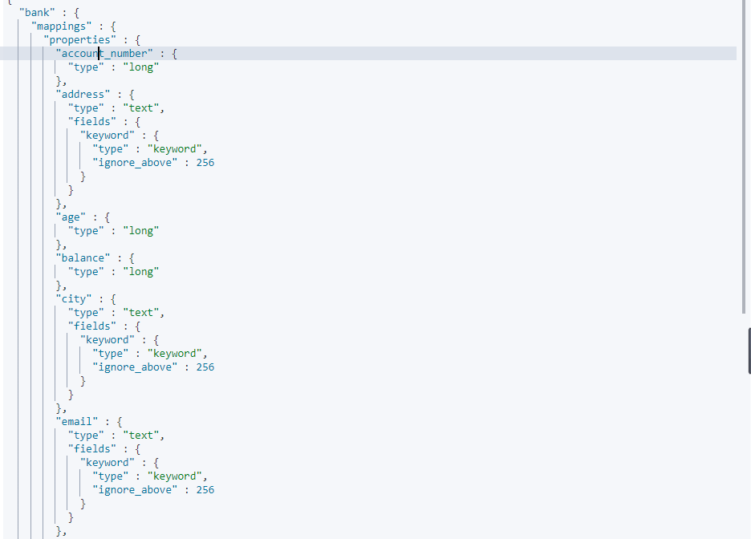

# glmall

## 人人renren-generator使用
a).下载项目[renren-generator](https://gitee.com/renrenio/renren-generator)

b).修改`application.yml`中数据库的地址
```yml
spring:
  datasource:
    type: com.alibaba.druid.pool.DruidDataSource
    #MySQL配置
    driverClassName: com.mysql.cj.jdbc.Driver
    url: jdbc:mysql://127.0.0.1:3306/gulimall_wms?useUnicode=true&characterEncoding=UTF-8&useSSL=false&serverTimezone=Asia/Shanghai
    username: root
    password: root
```
c).修改`generator.properties`文件，具体可以查看`resources/template/`下的文件
```properties

mainPath=com.xj.glmall
#包名
package=com.xj.glmall
#模块名
moduleName=ware
author=yu
email=yu
#数据库表前缀，生成的实体类会自动去掉
ablePrefix=wms_
```
d).修改`resources/template/Controller.java.vm`文件（可不修改），将`@RequestMapping`修改成对应restful请求注解

e).运行程序，将生成的代码复制到对应的模块中

## SpringCloud Alibaba
这里`spring-boot`版本为`2.1.8.RELEASE`，修改`glmall-common`的`pom.xml`文件
```xml
<dependencyManagement>
    <dependencies>
        <dependency>
            <groupId>com.alibaba.cloud</groupId>
            <artifactId>spring-cloud-alibaba-dependencies</artifactId>
            <version>2.2.0.RELEASE</version>
            <type>pom</type>
            <scope>import</scope>
        </dependency>
    </dependencies>
</dependencyManagement>
```

### Nacos注册中心
Nacos 是阿里巴巴开源的一个更易于构建云原生应用的动态服务发现、配置管理和服务管理平台。

下载`nacos`：[nacos下载](https://github.com/alibaba/nacos/releases)，然后运行

- 修改模块的`pom.xml`文件，引入Nacos Discovery Starter。
```xml
<dependency>
     <groupId>com.alibaba.cloud</groupId>
     <artifactId>spring-cloud-starter-alibaba-nacos-discovery</artifactId>
 </dependency>
```
- 在`application.yml`文件中配置Nacos Server地址，并配置服务命名
```yml
spring
    application: 
        name: glmall-coupon
    cloud:
        nacos:
          discovery:
            server-addr: 127.0.0.1:8848
```
- 在启动类上添加`@EnableDiscoveryClient`注解，开启服务注册功能

#### 使用`openfeign`
Nacos Discovery Starter 默认集成了 Ribbon ，所以对于使用了 Ribbon 做负载均衡的组件，可以直接使用 Nacos 的服务发现。

- 在`glmall-common`模块下添加`openfeign`的依赖（通用组件依赖都在`glmall-common`模块下添加）
```xml
<dependency>
    <groupId>org.springframework.cloud</groupId>
    <artifactId>spring-cloud-starter-openfeign</artifactId>
</dependency>
```
- 在`glmall-member`模块下创建一个`client`包，在此包下创建`CouponFeignService`用于测试，具体代码如下：
```java
@FeignClient(name = "glmall-coupon")//被远程调用的服务名
public interface CouponFeignService {

    @GetMapping("coupon/coupon/info/{id}")//请求路径，要写全
    public R info(@PathVariable("id") Long id);//参数和返回值要和被调用方法一样
}
```
- 在启动类上添加`@EnableFeignClients(basePackages = "com.xj.glmall.member.client")`注解，并配置接口所在包
- 测试:
```java

@RequestMapping("test/")
@RestController
public class TestController {
    @Autowired
    private CouponFeignService couponFeignService;

    @GetMapping("/coupon/info")
    public R test() {
        return couponFeignService.info(2l);
    }
}
```
- 启动这两个服务，并访问此方法。

### Nacos配置中心
Nacos配置中心可将Spring Cloud应用的配置交由Nacos管理

- 引入所需依赖
```xml
<dependency>
     <groupId>com.alibaba.cloud</groupId>
     <artifactId>spring-cloud-starter-alibaba-nacos-config</artifactId>
 </dependency>
```
- 在`resources`目录下创建`bootstrap.properties`文件，配置Nacos Config的元数据，以`glmall-member`模块为例：
```properties
spring.application.name=glmall-member
spring.cloud.nacos.config.server-addr=127.0.0.1:8848
```
- 访问`localhost:8848/nacos`，在配置列表中新建配置，Data ID为`服务命.properties`，还是以`glmall-membe`模块为例：


- 修改`TestController`：
```java
@RequestMapping("test")
@RestController
@RefreshScope//动态获取配置中心中的配置
public class TestController {
    @Autowired
    private CouponFeignService couponFeignService;
    @Value("${member.user.name}")
    private String name;

    @Value("${member.user.age}")
    private String age;

    @GetMapping("/coupon/info")
    public R test() {
        return couponFeignService.info(2l);
    }
    @GetMapping("/user")
    public R user(){
        Map map = new HashMap();
        map.put("name",name);
        map.put("age",age);
        return R.ok(map);
    }
}
```
- 启动服务测试


#### 命名空间
默认的命名空间为`public`，常用场景：
- 不同环境的注册的区分隔离，例如开发测试环境和生产环境的资源（如配置、服务）隔离等
- 不同服务的配置隔离

配置指定的命名空间，想要在`bootstrap.properites`中配置：
```properties
spring.cloud.nacos.discovery.namespace=命名空间ID
```
#### 配置分组
默认配置分组为`DEFAULT_GROUP`，在创建配置集（Data ID）时可以指定配置分组。
配置指定的分组，在`bootstrap.properites`中配置：
```properties
spring.cloud.nacos.config.group=组名
```
#### 加载多个配置集（Data ID）
在实际应用中，多个服务的一些配置可能相同，这时我们可以将这些配置拆分，如数据库配置、redis配置等，将这些配置拆分出来，放在配置中心，这样就避免了代码的重复编写，有可动态加载
在`bootstarp.properties`中配置：
```properties
spring.cloud.nacos.config.ext-config[0].data-id=DataID_1
spring.cloud.nacos.config.ext-config[0].group=group_1
spring.cloud.nacos.config.ext-config[0].refresh=true #是否支持动态加载配置，默认为false

spring.cloud.nacos.config.ext-config[0].data-id=DataID_2
spring.cloud.nacos.config.ext-config[0].group=group_2
spring.cloud.nacos.config.ext-config[0].refresh=true #是否支持动态加载配置，默认为false
```
按住`Ctrl`鼠标左键点击`ext-config`查看源码发现，`ext-config`是一个`List`集合，所以加载多个配置可以通过数组形式配置，若要获取配置中心的配置，以前`spring boot`获取配置文件的所有方式都可以
### Gateway网关
- 创建`glmall-gateway`模块，添加相关依赖：
```xml
<dependency>
    <groupId>com.xj.glmall</groupId>
    <artifactId>glmall-common</artifactId>
    <version>1.0.0-SNAPSHOT</version>
</dependency>
<dependency>
    <groupId>org.springframework.cloud</groupId>
    <artifactId>spring-cloud-starter-gateway</artifactId>
</dependency>
```
因为`nacos`相关的依赖都在`glmall-common`模块中，所以需要引入`glmall-common`的依赖
- 修改启动类：
```java
@SpringBootApplication(exclude = {DataSourceAutoConfiguration.class})//不加数据库相关配置
@EnableDiscoveryClient
@RefreshScope
public class GlmallGatewayApplication {
    public static void main(String[] args) {
        SpringApplication.run(GlmallGatewayApplication.class, args);
    }
}
```
- 在`glmall-common`模块中引入了`mybatis`相关依赖，而网关服务不需要数据库配置。

- 修改`resources`下的配置文件，将网关服务注册到`nacos`，具体可参照其他模块配置

#### 路由断言工厂（Route Predicate Factories）
满足某种条件就路由去哪里
##### 路由参数断言工厂（The Query Route Predicate Factory）
路由参数满足某种条件
`application.yml`配置：
```yaml
server:
  port: 10086
spring:
  application:
    name: glmall-gateway
  cloud:
    gateway:
      routes:
        - id: baidu
          uri: https://www.baidu.com
          predicates:
            - Query=url, baidu
        - id: qq
          uri: https://www.qq.com
          predicates:
            - Query=url, qq
```
配置说明：`- `表示一个数组，可配置多个，这是`yml`的语法；`id`：路由的id；`url`：满足条件后跳转的地址；`predicates`：这是一个数组，`- Query=...`可配置多个，`Query=url,baidu`表示请求路径中的参数`url=baidu`才会路由到`uri`这个地址，如`http://localhost:88/baidu?url=baidu`，这里符合第一个路由断言，所有它会跳转到`https://www.baidu.com`，参数的值可用正则表达式。
其他断言配置可参照官网：[spring cloud gateway](https://cloud.spring.io/spring-cloud-static/spring-cloud-gateway/2.2.3.RELEASE/reference/html/#gateway-request-predicates-factories)
## 后台管理界面搭建
下载好[renren-fast](https://gitee.com/renrenio/renren-fast)和[renren-fast-vue](https://gitee.com/renrenio/renren-fast-vue)。
### `renren-fast`配置
1.创建一个数据库`gulimall_admin`，执行`db`目录下的数据库文件，登录后台管理界面要用到的数据。

2.修改配置文件中数据库的地址，并配置服务名为`renren-fast`。

3.添加`glmall-common`模块的依赖，需要用到`nacos`。

4.创建`bootstrap.yml`文件，并配置`nacos`的地址（尝试在application.yml文件中配置，但是不起作用）：
```yaml
spring:
  cloud:
    nacos:
      discovery:
        server-addr: 127.0.0.1:8848
      config:
        server-addr: 127.0.0.1:8848
  application:
    name: renren-fast
```

5.在启动类上添加`@EnableDiscovery`注解开启服务注册与发现功能

### `renren-fast-vue`配置
1.在命令行窗口执行`npm install`，可能会报`Failed at the chromedriver@2.37.0 install script 'node install.js'`，这是因为下载源被封了，可使用淘宝的下载源下载：
```
npm install chromedriver --chromedriver_cdnurl=http://cdn.npm.taobao.org/dist/chromedriver
```
如果错误日志中有`node-sass`这样的字符串，那就是要安装`node-sass`：
```
npm install --save-dev node-sass
```
执行完这些命令后再执行`npm install`基本就不会报什么错了

3.配置向后台请求数据的地址，配置文件是`static/config`目录下的`index.js`：
```js
//window.SITE_CONFIG['baseUrl'] = '后台IP地址:{端口号}'
//例
window.SITE_CONFIG['baseUrl'] = '127.0.0.1:8080'
```

4.执行`npm run dev`，数据都要通过后台获取，所以要先启动`renren-fast`服务，登录后台界面账号为admin，密码也是

## 网关配置与路由重写
前端发送的请求全部路由到网关，再由网关分发给各个服务。
修改前端项目`static/config`目录下的`index.js`文件，将api请求地址修改为网关地址：
```javascript
window.SITE_CONFIG['baseUrl'] = '127.0.0.1:88/api'
```
以`glmall-product`模块为例。前端发送的请求都以`/api`开头，在网关中配置路由：
```yaml
server:
  port: 88
spring:
  application:
    name: glmall-gateway
  cloud:
    gateway:
      routes:
        - id: product_route
          uri: lb://glmall-product
          predicates:
            - Path=/api/product/**
          filters:
            - RewritePath=/api(?<segment>/?.*),/$\{segment}
        - id: admin_route
          uri: lb://renren-fast
          predicates:
            - Path=/api/**
          filters:
            - RewritePath=/api(?<segment>/?.*),/renren-fast/$\{segment}
```
网关这里拦截所有以`/api`开头的请求，然后通过断言和过滤匹配到精确的地址。精确的路由配置要在前面，不然会被其他路由匹配。
## 解决跨域问题
前端发送后台发送请求时会遇到跨域问题，`spring boot`为我们提供了解决跨域的方法，统一在网关配置：
```java

@Configuration
public class GlmallCorsConfiguration {
    @Bean
    public CorsWebFilter corsWebFilter(){
        UrlBasedCorsConfigurationSource source = new UrlBasedCorsConfigurationSource();
        CorsConfiguration config = new CorsConfiguration();
        config.addAllowedHeader("*");
        config.addAllowedMethod("*");
        config.addAllowedOrigin("*");
        config.setAllowCredentials(true);
        source.registerCorsConfiguration("/**",config);
        return new CorsWebFilter(source);
    }
}
```
## mybatis配置逻辑删除
在实际开发中，数据是最重要的，所以一般删除数据都不是真正的删除，而是逻辑删除，让这些数据不再显示。

以`gulimall_pms`数据库中的`pms_category`表为例。在此表中，有一个`show_status`字段，这里规定0-不显示，1-显示。

在`application.yml`文件中配置：
```yaml
mybatis-plus:
  mapper-locations: classpath:/mapper/**/*.xml
  global-config:
    db-config:
      id-type: auto
      logic-delete-value: 0 # 逻辑已删除值(默认为 1)
      logic-not-delete-value: 1 # 逻辑未删除值(默认为 0)
```

在对应实体类的字段上添加`@TableLogic`注解。参考[Mybatis-Plus官方文档](https://mp.baomidou.com/guide/logic-delete.html)

## spring cloud alibaba oss使用
新建一个模块`glmall-third-party`。 
引入`glmall-common`和`alicloud-oss starter`
```xml
<dependency>
     <groupId>com.xj.glmall</groupId>
     <artifactId>glmall-common</artifactId>
 </dependency>
<dependency>
     <groupId>com.alibaba.cloud</groupId>
     <artifactId>spring-cloud-starter-alicloud-oss</artifactId>
 </dependency>
```
在启动类上添加`@EnableDiscovery`注解
添加在`bootstrap.yml`中添加nacos的服务注册地址和配置中心地址（看前文配置），以及在`application.yml`文件中添加OOS服务对应的`accessKey`,`secretKey`,`endpoint`
```ymal
spring:
  cloud:
    alicloud:
        access-key: your-ak
        secret-key=your-sk
        oss:
           endpoint=***
```
在`glmall-third-party`模块下创建一个`OSSController.java`，用于处理文件上次
```java
@RequestMapping("/oss")
@RestController
public class OSSController {

    @Autowired
    private OSS ossClient;
    @Value("${spring.cloud.alicloud.access-key}")
    private String accessId;
    @Value("${spring.cloud.alicloud.secret-key}")
    private String accessKey;
    @Value("${spring.cloud.alicloud.oss.endpoint}")
    private String endpoint;
    @Value("${spring.cloud.alicloud.oss.bucket}")
    private String bucket;
    DateFormat dateFormat = new SimpleDateFormat("yyyy-MM-dd");


    @GetMapping("/policy")
    public R policy(){

        String host = "https://" + bucket + "." + endpoint; // host的格式为 bucketname.endpoint
        String format = dateFormat.format(new Date());
        String dir = format + "/"; // 用户上传文件时指定的前缀。
        Map<String, String> respMap = null;
        // 创建OSSClient实例。
        try {
            long expireTime = 30;
            long expireEndTime = System.currentTimeMillis() + expireTime * 1000;
            Date expiration = new Date(expireEndTime);
            // PostObject请求最大可支持的文件大小为5 GB，即CONTENT_LENGTH_RANGE为5*1024*1024*1024。
            PolicyConditions policyConds = new PolicyConditions();
            policyConds.addConditionItem(PolicyConditions.COND_CONTENT_LENGTH_RANGE, 0, 1048576000);
            policyConds.addConditionItem(MatchMode.StartWith, PolicyConditions.COND_KEY, dir);

            String postPolicy = ossClient.generatePostPolicy(expiration, policyConds);
            byte[] binaryData = postPolicy.getBytes("utf-8");
            String encodedPolicy = BinaryUtil.toBase64String(binaryData);
            String postSignature = ossClient.calculatePostSignature(postPolicy);

            respMap = new LinkedHashMap<String, String>();
            respMap.put("accessid", accessId);
            respMap.put("policy", encodedPolicy);
            respMap.put("signature", postSignature);
            respMap.put("dir", dir);
            respMap.put("host", host);
            respMap.put("expire", String.valueOf(expireEndTime / 1000));
        } catch (Exception e) {
            // Assert.fail(e.getMessage());
            System.out.println(e.getMessage());
        } finally {
            ossClient.shutdown();
        }
        return R.ok().put("data",respMap);
    }
}
```
详情查看[OSS对象存储](https://help.aliyun.com/document_detail/91868.html?spm=a2c4g.11186623.2.15.40b46e28LIgXMz#concept-ahk-rfz-2fb)
### 前端配置
将封装好的组件放在前端工程下的`src/components`目录下，在`brand-add-or-update.vue`下引入该组件
```js
import SingleUpload from "@/components/upload/singleUpload";
export default{
    components:{SingleUpload}
}
```
其余自行修改

### JSR303

1. 给实体类添加校验注解：javax.validation.constrains，并定义自己的错误提示信息
.jpg)
2. 开启校验功能@Valid，效果：校验错误以后会有默认的响应
.jpg)

#### JSR303分组校验
为JSR303校验注解添加`group`属性，`group`是一个接口类型的数组。创建两个空接口，分别为`AddGroup`、`UpdateGroup`。
这两个接口分别表示新增异常信息和更新异常信息。想要分组校验生效还需修改`Controller`类中的`@valid`注解，将此注解修改为`@Validated`注解，此注解有个值为接口类型数组的属性，指定校验的分组。
注意，如果要使用校验分组那所有的字段都必须使用，否则未使用校验分组的字段将不进行校验
例：
```java
//实体类代码
@TableId
@NotNull(message = "品牌id不能为空",groups = UpdateGroup.class)
@Null(message = "新增品牌id必须为空",groups = AddGroup.class)
private Long brandId;

//Controller代码
@PostMapping("/update")
public R update(@Validated(UpdateGroup.class) @RequestBody BrandEntity brand){
	brandService.updateById(brand);

    return R.ok();
}
```
在此例中，新增时它会校验id必须为空，修改时校验id不能为空
#### 自定义校验注解
在`glmall-common`中导入所需依赖
```xml
<dependency>
    <groupId>javax.validation</groupId>
    <artifactId>validation.api</artifactId>
    <version>2.0.1.Final</version>
</dependency>
```
以显示状态为例，值只能为0或1，0为不显示，1为显示。
可以查看`JSR303`校验注解
```java
@Documented
//指定校验器，未指定需要在初始化时指定
@Constraint(
    validatedBy = {}
)
//注解可标注位置
@Target({ElementType.METHOD, ElementType.FIELD, ElementType.ANNOTATION_TYPE, ElementType.CONSTRUCTOR, ElementType.PARAMETER, ElementType.TYPE_USE})
//合适能获取注解
@Retention(RetentionPolicy.RUNTIME)
public @interface NotBlank {
    String message() default "{javax.validation.constraints.NotBlank.message}";//校验出错后取错误信息的地址

    Class<?>[] groups() default {};//分组

    Class<? extends Payload>[] payload() default {};//负载
}
```
在`JSR303`规范中，校验注解必须要有以上注解及属性。创建`ListValue`注解类型
```java
@Documented
@Constraint(
        validatedBy = {}
)
@Target({ElementType.METHOD, ElementType.FIELD, ElementType.ANNOTATION_TYPE, ElementType.CONSTRUCTOR, ElementType.PARAMETER, ElementType.TYPE_USE})
@Retention(RetentionPolicy.RUNTIME)
public @interface ListValue {
    //值一般为该类的全限定类型.属性名
    String message() default "{com.xj.glmall.product.entity.ListValue.message}";

    Class<?>[] groups() default {};

    Class<? extends Payload>[] payload() default {};
}
```
`JSR303`的错误信息放在名为`ValidationMessage.properties`中，可以查看此文件来定义错误信息
```properties
javax.validation.constraints.NotBlank.message        = must not be blank
javax.validation.constraints.NotEmpty.message        = must not be empty
javax.validation.constraints.NotNull.message         = must not be null
javax.validation.constraints.Null.message            = must be null
javax.validation.constraints.Past.message            = must be a past date
javax.validation.constraints.PastOrPresent.message   = must be a date in the past or in the present
javax.validation.constraints.Pattern.message         = must match "{regexp}"
```
创建`ValidationMessage.properties`，添加如下内容
```properties
com.xj.glmall.common.valid.ListValue.message=必须提交指定的值
```
接下来定义校验器，查看`@Constraint`注解，校验器为一个`ConstraintValidator`类型的数组，它有两个泛型，第一个为要检验的注解，另一个为要校验的值的类型。这是一个接口，必须实现它。
```java
public interface ConstraintValidator<A extends Annotation, T> {

	//初始化方法
	default void initialize(A constraintAnnotation) {
	}

	//判断是否成功
	boolean isValid(T value, ConstraintValidatorContext context);
}

```
创建`ListValueConstraintValidator`，实现`ConstraintValidator`接口
```java
public class ListValueConstraintValidator implements ConstraintValidator<ListValue,Integer> {

    //存储注解上的值
    private Set<Integer> set = new HashSet<>();

    @Override
    public void initialize(ListValue constraintAnnotation) {
        //获取注解上的值
        int[] vals = constraintAnnotation.vals();
        for (int val : vals) {
            set.add(val);
        }
    }

    /**
     * 判断是否校验成功
     * @param value 需要校验的值
     * @param context
     * @return
     */
    @Override
    public boolean isValid(Integer value, ConstraintValidatorContext context) {
        if (set.contains(value)) {
            return true;
        }
        return false;
    }
}
```
最后，为`@ListValue`指定校验器
```java
@Constraint(
        validatedBy = {ListValueConstraintValidator.class}
)
```
### 统一异常处理
1. 编写异常处理类，在类上添加`@RestontrollerAdvice`，以json字符串返回结果
2. 编写异常处理方法，并在方法上添加`@ExceptionHandler`注解，标注要捕获的异常
```java
@Slf4j
@RestControllerAdvice(basePackages = "com.xj.glmall.product.controller")//捕获com.xj.glmall.product.controller包下的异常
public class GlmallExceptionControllerAdvice {
    private static final Logger LOGGER = LoggerFactory.getLogger(GlmallExceptionControllerAdvice.class);
    @ExceptionHandler(value = MethodArgumentNotValidException.class)//捕获MethodArgumentNotValidException异常
    public R handleVaildException(MethodArgumentNotValidException e) {
        LOGGER.error("数据校验出现问题{}，异常类型：{}",e.getMessage(),e.getClass());
        BindingResult result = e.getBindingResult();//获取出现异常的字段及信息
        Map<String,String> errorMap = new HashMap<>();
        result.getFieldErrors().forEach((fieldError -> {
            errorMap.put(fieldError.getField(),fieldError.getDefaultMessage());
        }));
        return R.error().put("data",errorMap);
    }

}
```
## POJO四种类型
- VO（View Object）：视图对象，用于展示层，它的作用是把某个指定页面（或组件）的所有数据封装起来。
- DTO（Data Transfer Object）：数据传输对象，这个概念来源于J2EE的设计模式，原来的目的是为了EJB的分布式应用提供粗粒度的数据实体，以减少分布式调用的次数，从而提高分布式调用的性能和降低网络负载，但在这里，我泛指用于展示层与服务层之间的数据传输对象。
- DO（Domain Object）: 领域对象，就是从现实世界中抽象出来的有形或无形的业务实体。
- PO（PersistentObject）：持久化对象，它跟持久层（通常是关系型数据库）的数据结构形成一一对应的映射关系，如果持久层是关系型数据库，那么，数据表中的每个字段（或若干个）就对应PO的一个（或若干个）属性。
# linux环境搭建

## linux 安装Java
1.查看本地是否自带Java环境
```shell script
yum list installed | grep java
```
2.卸载自带的Java
```shell script
yum -y remove java-1.8.0-openjdk*
yum -y remove tzdata-java*
```
3.下载[java](https://www.oracle.com/java/technologies/javase/javase-jdk8-downloads.html#license-lightbox)，通过xshell上传
4.解压
```shell script
tar -zxvf jdk-8u261-linux-i586.tar.gz
```
5.将解压好的文件运动到`/opt/java`目录下
```shell script
mv jdk-8u261-linux-i586 /opt/java
```
6.配置环境变量
```shell script
vi /etc/profile
# 将此内容复制到/etc/profile文件中
export JAVA_HOME=/opt/java/
export JRE_HOME=$JAVA_HOME/jre  
export PATH=$PATH:$JAVA_HOME/bin:$JRE_HOME/bin
export CLASSPATH=.:$JAVA_HOME/lib/dt.jar:$JAVA_HOME/lib/tools.jar:$JRE_HOME/lib
```
7.使配置立即生效
```shell script
source /etc/profile
```
遇到问题：/lib/ld-linux.so.2: bad ELF interpreter: No such file or directory
解决方法：安装glibc包
```shell script
yum install glibc.i686
```
## 安装maven
1.下载[maven](https://downloads.apache.org/maven/maven-3/3.6.3/binaries/apache-maven-3.6.3-bin.tar.gz)
2.将下载的maven通过xshell上传到linux
3.解压
```shell script
tar -zxvf apache-maven-3.6.3-bin.tar.gz
```
4.将解压好的文件移动到`/opt/maven`目录下
```shell script
mv /apache-maven-3.6.3 /opt/maven
```
5.配置环境变量
```shell script
vi /etc/profile
# 将一下内容添加到profile文件
export MAVEN_HOME=/opt/maven
export PATH=$MAVEN_HOME/bin:$PATH
```
6.重新加载配置文件
```shell script
source /etc/profile
```
## 安装redis
1.使用`wget`下载redis
```shell script
wget http://download.redis.io/releases/redis-4.0.8.tar.gz
```
2.解压redis
```shell script
tar -zxvf redis-4.0.8.tar.gz
```
3.将redis移动到`/usr/local/redis/`目录下
```shell script
mv redis-4.0.8 /usr/local/redis
```
4.切换到`/usr/local/redis`目录下，执行`make`命令编译redis
```shell script
cd /usr/local/redis
make
```
5.切换到`src`目录下，安装redis
```shell script
cd /usr/local/redis/src
make install PREFIX=/usr/local/redis
```
6.配置redis为后台启动
```shell script
vi /usr/local/redis/etc/redis.conf #将daemonize no 改成daemonize yes
```
7.将redis加入到开机启动
```shell script
vi /etc/rc.local #在里面添加内容：/usr/local/redis/bin/redis-server /usr/local/redis/etc/redis.conf (意思就是开机调用这段开启redis的命令)
```
8.开启redis
```shell script
/usr/local/redis/bin/redis-server /usr/local/redis/etc/redis.conf
```
遇到问题：
1.编译失败，提示有两个错误,解决办法：
执行以下命令
```shell script
yum install cpp
yum install binutils
yum install glibc
yum install glibc-kernheaders
yum install glibc-common
yum install glibc-devel
yum install gcc
yum install make
```
2.提示`fatal error: jemalloc/jemalloc.h: No such file or directory`，解决办法：
执行以下命令:
```shell script
make MALLOC=libc
```

## 安装elasticsearch
拉取es镜像
```shell script
docker pull elasticsearch:7.4.2
```
创建文件夹，用来挂载docker容器中es的配置及数据
```shell script
mkdir -p /mydata/elasticsearch/config
mkdir -p /mydata/elasticsearch/data
echo "http.host:0.0.0.0">>/mydata/elasticsearch/config/elasticsearch.yml  #将内容输出到elasticsearch.yml文件中
```
启动容器
```shell script
docker run --name elasticsearch -p 9200:9200 -p 9300:9300 \
-e "discovery.type=single-node" \
-e ES_JAVA_OPS="-Xms64 -Xms128m" \
-v /mydata/elasticsearch/config/elasticsearch.yml:/usr/share/elasticsearch/config/elasticsearch.yml \
-v /mydata/elasticsearch/data:/usr/share/elasticsearch/data \
-v /mydata/elasticsearch/plugins:/usr/share/elasticsearch/plugins \
-d elasticsearch:7.4.2
# --name：启动容器的名称 
# -p：9200映射对应本地访问端口，9300映射本地集群通信端口
# -e："discovery.type=single-node"->以单节点启动，ES_JAVA_OPS="-Xms64 -Xms128m"->初始暂用内存64m，最大占用内存128m
# -v：挂载目录
# -d：后台运行容器，并返回容器ID
```
遇到问题：
1.没有`/mydata/elasticsearch`目录的读写执行权限，解决方法：设置所有用户都有该目录的读写执行权限
```shell script
chmod -R 777 /mydata/elasticsearch
# -R：递归执行
```

## 安装kibana
1.拉取镜像
```shell script
docker pull kibana:7.4.2
```
2.启动容器
```shell script
docker run --name kibana -e ELASTICSEARCH_HOSTS=http://ip:9200 -p 5601:5601 -d kibana:7.4.2
```
## ES学习

### ES入门
1. `_cat`介绍
- GET /_cat/nodes：查看所有节点
- GET /_cat/health：查看es健康情况
- GET /_cat/master：查看主节点
- GET /_cat/indices：查看所有索引 
2. 索引一个文档（保存）
- PUT(POST) /customer/external/1
customer索引，类似于MySQL的数据库，external类型，类似于数据库的表，1为id（唯一标识）
例：`http://127.0.0.1:9200/customer/external/1`
```json
{
    "name":"test",
    "age": 12,
    "gender": "0"
}
```
向该链接发送put(post)请求，上面为请求的json格式的数据，返回的数据如下
.png)
同样的请求发送多次会变为更新操作，`result`字段的值会变为“update”，`_version`值会加1。如果不指定唯一标识，es会自动生成，并返回。如果用put请求，必须带上id
3. 查询文档
- GET /customer/external/1 查询id为1的文档，返回值如下：
.png)
4. 乐观锁修改
使用post（put）修改文档时，带上`_seq_no`和`_primary_term`的值，该值只能是当前文档最新的值。如果有两个请求带着这两个值修改当前文档，第一个请求修改成功了，`_seq_no`的值就会自增1，另一个请求如果要修改必须是已更新的`_seq_no`或`_primary_term`的值，请求如下：
POST http://127.0.0.1:9200/customer/external/1?if_seq_no=2&if_primary_term=1
```json
{
    "name":"jone",
    "age": 12,
    "gender": 1
}
```          
返回值：
.jpg)
5. 更新数据
- POST http://127.0.0.1:9200/customer/external/1/_update
```json
{
    "doc":{
        "name":"jone",
        "age": 12,
        "gender": 1
     }
}
```
该请求会对比原来数据，如果数据没有改变，本版号不更新
- POST(PUT) http://127.0.0.1:9200/customer/external/1
```json
{
    "name":"jone",
    "age": 12,
    "gender": 1
}
```
该请求不会检查原数据，版本号始终会自增1
6. 删除索引&文档
- DELETE http://127.0.0.1:9200/customer 删除索引

- DELETE http://127.0.0.1:9200/customer/external/1删除文档
查询已删除文档
.jpg)
查询已删除索引
.jpg)
### 进阶
1. bulk批量操作api
语法格式
```text
{action:{metadata}}\n
{request body}\n
{action:{metadata}}\n
{request body}\n
```
- 批量新增实例
POST /customer/external/_bulk
```text
{"index":{"_id":1}}
{"name":"test1"}
{"index":{"_id":2}}
{"name":"test2"}
```
两行为一次操作，第一行为添加数据的id，第二行为添加的数据。每个操作互不影响
- 复杂实例
POST  /_bulk
```text
{"delete":{"_index":"website","_type":"blog","_id":"123"}}
{"create":{"_index":"website","_type":"blog","_id":"123"}}
{"title":"my first blog post"}
{"index":{"_index":"website","type":"blog"}}
{"title":"my second blog post"}
{"update":{"_index":"website","_type":"blog","_id":"123"}}
{"doc":{"title": "update my blog post"}}
```
删除没有请求体，所以只有一行
2. [批量导入测试数据](https://github.com/elastic/elasticsearch/blob/master/docs/src/test/resources/accounts.json)
3. 检索
查看[elastic中文文档](https://www.kancloud.cn/yiyanan/elasticsearch_7_6/1668542)
- `query`：定制查询条件
1). `match_all`:查询所有
```json
{
  "query": {
    "match_all": {}
  }
}
```
2). `match`：查询`address`字段中含有`Rockwell`或`Place`的数据
```json
{
  "query": {
    "match": {
      "address": "Rockwell Place"
    }
  }
}
```
3). `match_phrase`：查询`address`字段中含有`Rockwell Place`的数据
```json
{
  "query": {
    "match_phrase": {
      "address": "Rockwell Place"
    }
  }
}
```
4). `multi_match`：查询`firstname`字段或`address`字段包含`Ferry`或`Jenkins`的数据
```json
{
  "query": {
    "multi_match": {
      "query": "Ferry Jenkins",
      "fields": ["firstname","address"]
    }
  }
}
```
5). `bool`：组合多个条件查询。
a. must：必须匹配
b. must_not：必须不匹配
c. should：期望匹配，不匹配也可，若满足，相关性得分会更高
6). 'filter'：过滤，不会计算相关性得分
7). 'term'：多用于匹配非text字段的精确查询，多个单词的精确值无法匹配，语法与match相同
8). 'FIELD.keyword'：用于精确匹配,如下，匹配address为"880 Holmes Lane"的数据
```json
{
  "query": {
    "match": {
      "address.keyword": "880 Holmes Lane"
    }
  }
}
```
- `from`和`size`：用于分页，每页显示10条数据，从第二页开始显示。起始页from值为0
```json
{
  "query": {
    "match": {
      "address": "Rockwell Place"
    }
  },
  "from": 1,
  "size": 10
}
```
- `sort`：值是一个数组，指定排序字段
```json
{
  "query": {
    "match": {
      "address": "Rockwell Place"
    }
  },
  "from": 1,
  "size": 10,
  "sort": [
    {
      "age": {
        "order": "asc"
      }
    }
  ]
}
```
- `_source`：指定显示哪些字段，值为数组
#### 聚合
aggs：聚合，对已查询到的数据进行分析。可以有多个聚合，对已聚合和的数据可以内嵌聚合。参考[官方文档](https://www.elastic.co/guide/en/elasticsearch/reference/7.x/search-aggregations.html)
- 查询每个年龄的人数
```json
{
  "query": {"match_all": {}},
  "aggs": {
    "age_aggs": {
      "terms": {
        "field": "age",
        "size": 10
      }
    }
  }
}
```
- 查询每个年龄的人数与年龄的平均值
```json
{
  "query": {"match_all": {}},
  "aggs": {
    "age_aggs": {
      "terms": {
        "field": "age",
        "size": 10
      }
    },
    "age_avg":{
      "avg": {
        "field": "age"
      }
    }
  }
}
```
- 查询每个年龄段的平均工资
```json
{
  "query": {
    "match_all": {}
  },
  "aggs": {
    "age_aggs": {
      "terms": {
        "field": "age",
        "size": 10
      },
      "aggs": {
        "balance_avg": {
          "avg": {
            "field": "balance"
          }
        }
      }
    }
  },
  "size": 0
}
```
- 查出所有年龄分布，并且这些年龄段中的男性和女性的平均薪资以及这个年龄段总体的平均薪资。（text字段聚合需要使用FIELD.keyword）
```json
{
  "query": {"match_all": {}},
  "aggs": {
    "age_aggs": {
      "terms": {
        "field": "age",
        "size": 100
      },
      "aggs": {
        "gender_aggs": {
          "terms": {
            "field": "gender.keyword",
            "size": 100
          },
          "aggs": {
            "balance_avg": {
              "avg": {
                "field": "balance"
              }
            }
          }
        },
        "balance_avg": {
          "avg": {
            "field": "balance"
          }
        }
      }
    }
  },
  "size": 0
}
```
#### 映射
在创建索引时，可以预先定义字段的类型（映射类型，也就是type，一个索引可以有一个或多个类型）及相关属性。

es字段有哪些类型可查看[文档](https://www.elastic.co/guide/en/elasticsearch/reference/7.x/mapping-types.html)

通过向`http://127.0.0.1:9200/brank/_mapping`发送GET请求可以获取到`brank`索引的映射信息，获取到的部分映射信息如下：


可以看到数值类型字段会被es解析成`long`类型，文本类型被解析成`text`类型。文本类型有个内置字段keyword，es不会对它进行分析，只有完全匹配才能搜索到

在创建索引前预定字段类型需要向es发送PUT请求：`http://l27.0.0.1:9200/test_index`,`test_index`是索引，请求数据如下：
```json
{
  "mappings": {
    "properties": {
      "age": {
        "type": "integer"
      },
      "email": {
        "type": "keyword"
      },
      "name": {
        "type": "text"
      }
    }
  }
}
```
已添加的索引不能修改，只能向索引中添加索引，发送PUT请求：`http://l27.0.0.1:9200/test_index/_mapping`，请求数据如下：
```json
{
  "properties":{
    "employee_id": {
      "type": "keyword",
      "index": false
    }
  }
}
```
此内容为为索引`test_index`添加一个`employee_id`映射，类型为`keywork`，这个类型不能被分析，只能精确匹配，`index`为flase表示此字段不会被索引，该值默认为true，即不能用于检索。。

更多信息查看[文档](https://www.elastic.co/guide/en/elasticsearch/reference/7.x/mapping-params.html)

#### 更新映射
更新已存在的映射就必须创建新的索引，然后进行数据迁移。已`bank`索引为例，新建一个索引`newbank`，并预先定义字段映射
PUT /newbank
```json
{
  "mappings": {
    "properties" : {
        "account_number" : {
          "type" : "long"
        },
        "address" : {
          "type" : "text"
        },
        "age" : {
          "type" : "integer"
        },
        "balance" : {
          "type" : "long"
        },
        "city" : {
          "type" : "text"
        },
        "email" : {
          "type" : "keyword"
        },
        "employer" : {
          "type" : "keyword"
        },
        "firstname" : {
          "type" : "text"
        },
        "gender" : {
          "type" : "keyword"
        },
        "lastname" : {
          "type" : "text"
        },
        "state" : {
          "type" : "keyword"
        }
      }
    }
  }
```
创建好索引后在进行数据迁移，固定语法为：
POST _reindex
```json
{
  "source": {
    "index": "my-index-000001"
  },
  "dest": {
    "index": "my-new-index-000001"
  }
}
```
将`bank`索引的内容迁移到`newbank`索引
```json
{
  "source": {
    "index": "bank",
    "type": "account"
  },
  "dest": {
    "index": "newbank"
  }
}
```
因为在创建`bank`索引时使用了`type`，所以迁移的时候加上了`type`，但是`type`即将被废弃，现在也可以不使用`type`。参考[文档](https://www.elastic.co/guide/en/elasticsearch/reference/7.x/docs-reindex.html)

### 分词
es通过分词器接受一个字符流，将它分割成一个个单词，然后用这些单词进行匹配。es使用的标准分词器，是将英语按照空格分割成一个个单词，将中文分割成一个个汉字，如下：
POST _analyze
```json
{
  "analyzer": "standard",
  "text": "what do you say? my english is not good.哈哈"
}
```
返回结果：
```json
{
  "tokens" : [
    {
      "token" : "what",
      "start_offset" : 0,
      "end_offset" : 4,
      "type" : "<ALPHANUM>",
      "position" : 0
    },
    {
      "token" : "do",
      "start_offset" : 5,
      "end_offset" : 7,
      "type" : "<ALPHANUM>",
      "position" : 1
    },
    {
      "token" : "you",
      "start_offset" : 8,
      "end_offset" : 11,
      "type" : "<ALPHANUM>",
      "position" : 2
    },
    {
      "token" : "say",
      "start_offset" : 12,
      "end_offset" : 15,
      "type" : "<ALPHANUM>",
      "position" : 3
    },
    {
      "token" : "my",
      "start_offset" : 17,
      "end_offset" : 19,
      "type" : "<ALPHANUM>",
      "position" : 4
    },
    {
      "token" : "english",
      "start_offset" : 20,
      "end_offset" : 27,
      "type" : "<ALPHANUM>",
      "position" : 5
    },
    {
      "token" : "is",
      "start_offset" : 28,
      "end_offset" : 30,
      "type" : "<ALPHANUM>",
      "position" : 6
    },
    {
      "token" : "not",
      "start_offset" : 31,
      "end_offset" : 34,
      "type" : "<ALPHANUM>",
      "position" : 7
    },
    {
      "token" : "good",
      "start_offset" : 35,
      "end_offset" : 39,
      "type" : "<ALPHANUM>",
      "position" : 8
    },
    {
      "token" : "哈",
      "start_offset" : 40,
      "end_offset" : 41,
      "type" : "<IDEOGRAPHIC>",
      "position" : 9
    },
    {
      "token" : "哈",
      "start_offset" : 41,
      "end_offset" : 42,
      "type" : "<IDEOGRAPHIC>",
      "position" : 10
    }
  ]
}
```
要对中文分词需要额外安装ik分词器。
Windows下安装ik分词器：
1. 下载ik分词器[下载地址](https://github.com/medcl/elasticsearch-analysis-ik/releases/download/v7.4.2/elasticsearch-analysis-ik-7.4.2.zip)
2. 在es安装目录下的`plugins`目录下新建一个analysis-ik目录，将解压好的文件全部复制到此目录下
3. 重启es及kibana
Linux下安装ik分词器：
1. 第一步还是下载好ik分词器
2. 若es使用docker安装的，并且没有将文件挂载到本地目录，则需要进入容器内部
```shell script
docker exec -it elasticsearch /bin/bash
```
3. 进入到plugins目录：`cd plugins`，创建ik目录：`mkdir ik`,将ik分词器的文件复制到此目录
4. 若已将对应目录挂载到了本地目录，则直接将文件复制到对应目录
5. 重启es及kibana
```shell script
docker restart elasticsearch
docker restart kibana
```
ik分词器有两种，`ik_smart`只能分词和`ik_max_word`
`ik_smart`分词器使用：
POST _analyze
```json
{
  "analyzer": "ik_smart",
  "text":"这是ik分词器"
}
```
返回结果：
```json
{
  "tokens" : [
    {
      "token" : "这是",
      "start_offset" : 0,
      "end_offset" : 2,
      "type" : "CN_WORD",
      "position" : 0
    },
    {
      "token" : "ik",
      "start_offset" : 2,
      "end_offset" : 4,
      "type" : "ENGLISH",
      "position" : 1
    },
    {
      "token" : "分词器",
      "start_offset" : 4,
      "end_offset" : 7,
      "type" : "CN_WORD",
      "position" : 2
    }
  ]
}
```
`ik_max_word`分词器使用：
POST _analyze
```json
{
  "analyzer": "ik_max_word",
  "text":"这是ik分词器"
}
```
返回结果：
```json
{
  "tokens" : [
    {
      "token" : "这是",
      "start_offset" : 0,
      "end_offset" : 2,
      "type" : "CN_WORD",
      "position" : 0
    },
    {
      "token" : "ik",
      "start_offset" : 2,
      "end_offset" : 4,
      "type" : "ENGLISH",
      "position" : 1
    },
    {
      "token" : "分词器",
      "start_offset" : 4,
      "end_offset" : 7,
      "type" : "CN_WORD",
      "position" : 2
    },
    {
      "token" : "分词",
      "start_offset" : 4,
      "end_offset" : 6,
      "type" : "CN_WORD",
      "position" : 3
    },
    {
      "token" : "器",
      "start_offset" : 6,
      "end_offset" : 7,
      "type" : "CN_CHAR",
      "position" : 4
    }
  ]
}
```
可以看到`ik_max_word`分得更细。但是ik分词器对于一些新词汇会并不进行分词，只会将它们解析成一个个汉字。要对新词汇进行分词，可以引入自定义词库。

#### 自定义词库
通过修改ik分词器的配置文件IKAnalyzer.cfg.xml，可以添加自定义词库
```xml
<?xml version="1.0" encoding="UTF-8"?>
<!DOCTYPE properties SYSTEM "http://java.sun.com/dtd/properties.dtd">
<properties>
	<comment>IK Analyzer 扩展配置</comment>
	<!--用户可以在这里配置自己的扩展字典 -->
	<entry key="ext_dict"></entry>
	 <!--用户可以在这里配置自己的扩展停止词字典-->
	<entry key="ext_stopwords"></entry>
	<!--用户可以在这里配置远程扩展字典 -->
	<entry key="remote_ext_dict">http://localhost/ik.txt</entry>
	<!--用户可以在这里配置远程扩展停止词字典-->
	<!-- <entry key="remote_ext_stopwords">words_location</entry> -->
</properties>

```
自定义词库可以通过nginx请求获取:
- 下载[nginx](http://nginx.org/download/nginx-1.14.2.zip)并解压
- 新建一个ik.txt文件放在nginx目录下的html目录下
- 启动nginx
- 如上修改ik分词器配置文件
- 重启es
在Linux下添加自定义词库方法也是一样
### Java操作es
Java使用[Java High Level REST Client](https://www.elastic.co/guide/en/elasticsearch/client/java-rest/7.4/java-rest-high.html)操作es。
使用步骤：
1. 在父工程下创建`glmall-search`项目
2. 导入相关依赖，完整pom.xml文件如下：
```xml
<?xml version="1.0" encoding="UTF-8"?>
<project xmlns="http://maven.apache.org/POM/4.0.0" xmlns:xsi="http://www.w3.org/2001/XMLSchema-instance"
         xsi:schemaLocation="http://maven.apache.org/POM/4.0.0 https://maven.apache.org/xsd/maven-4.0.0.xsd">
    <modelVersion>4.0.0</modelVersion>
    <parent>
        <groupId>org.springframework.boot</groupId>
        <artifactId>spring-boot-starter-parent</artifactId>
        <version>2.1.8.RELEASE</version>
        <relativePath/> <!-- lookup parent from repository -->
    </parent>
    <groupId>com.xj.glmall</groupId>
    <artifactId>glmall-search</artifactId>
    <version>1.0.0-SNAPSHOT</version>
    <name>glmall-search</name>
    <description>搜索</description>

    <properties>
        <java.version>1.8</java.version>
        <elasticsearch.version>7.4.2</elasticsearch.version>
    </properties>

    <dependencies>
        <dependency>
            <groupId>com.xj.glmall</groupId>
            <artifactId>glmall-common</artifactId>
            <version>1.0.0-SNAPSHOT</version>
        </dependency>
        <dependency>
            <groupId>org.elasticsearch.client</groupId>
            <artifactId>elasticsearch-rest-high-level-client</artifactId>
            <version>7.4.2</version>
        </dependency>

        <dependency>
            <groupId>org.springframework.boot</groupId>
            <artifactId>spring-boot-starter</artifactId>
        </dependency>

        <dependency>
            <groupId>org.springframework.boot</groupId>
            <artifactId>spring-boot-starter-test</artifactId>
            <scope>test</scope>
        </dependency>
    </dependencies>

    <build>
        <plugins>
            <plugin>
                <groupId>org.springframework.boot</groupId>
                <artifactId>spring-boot-maven-plugin</artifactId>
            </plugin>
        </plugins>
    </build>

    <repositories>
        <repository>
            <id>spring-milestones</id>
            <name>Spring Milestones</name>
            <url>https://repo.spring.io/milestone</url>
        </repository>
        <repository>
            <id>spring-snapshots</id>
            <name>Spring Snapshots</name>
            <url>https://repo.spring.io/snapshot</url>
            <snapshots>
                <enabled>true</enabled>
            </snapshots>
        </repository>
    </repositories>
    <pluginRepositories>
        <pluginRepository>
            <id>spring-milestones</id>
            <name>Spring Milestones</name>
            <url>https://repo.spring.io/milestone</url>
        </pluginRepository>
        <pluginRepository>
            <id>spring-snapshots</id>
            <name>Spring Snapshots</name>
            <url>https://repo.spring.io/snapshot</url>
            <snapshots>
                <enabled>true</enabled>
            </snapshots>
        </pluginRepository>
    </pluginRepositories>

</project>

```
因为此项目springboot本版为2.1.8，elasticsearch默认版本为6.4.3，所以还要修改elasticsearch版本
```xml
<properties>
    <java.version>1.8</java.version>
    <elasticsearch.version>7.4.2</elasticsearch.version>
</properties>
```
3. 因为引入了`glmall-common`工程，它里面有mysql相关依赖，而这里暂时不需要这些依赖，所以需要排除掉数据源相关依赖
```java
@EnableDiscoveryClient
@EnableFeignClients
@SpringBootApplication(exclude = DataSourceAutoConfiguration.class)
public class GlmallSearchApplication {

    public static void main(String[] args) {
        SpringApplication.run(GlmallSearchApplication.class, args);
    }

}
```
4. 依赖问题解决后，就需要配置es，新建一个`config`包，在此包下新建`GlmallElasticsearchConfig`类，具体如下：
```java
@Configuration
public class GlmallElasticsearchConfig {

     //通用设置项
        public static final RequestOptions COMMON_OPTIONS;
        static {
            RequestOptions.Builder builder = RequestOptions.DEFAULT.toBuilder();
            /*builder.addHeader("Authorization", "Bearer " + TOKEN);
            builder.setHttpAsyncResponseConsumerFactory(
                    new HttpAsyncResponseConsumerFactory
                            .HeapBufferedResponseConsumerFactory(30 * 1024 * 1024 * 1024));*/
            COMMON_OPTIONS = builder.build();
        }
    
        /**
         * 注入restHighLevelClient
         * @return
         */
        @Bean
        public RestHighLevelClient esRestClient(){
            RestClientBuilder builder = null;
            builder = RestClient.builder(
                    new HttpHost("localhost", 9200, "http"),
                    new HttpHost("localhost", 9201, "http")
            );
            RestHighLevelClient client = new RestHighLevelClient(builder);
            return client;
        }
}
```
#### 使用`RestHighLevelClient`
参考[官方文档](https://www.elastic.co/guide/en/elasticsearch/client/java-rest/7.4/java-rest-high-supported-apis.html)
创建一个测试类，并注入`RestHighLevelClient`
```java
@RunWith(SpringRunner.class)
@SpringBootTest
public class GlmallSearchTest {

    @Autowired
    private RestHighLevelClient client;
}
```
创建一个`User`类用于测试
```java
public class User {
    private String name;
    private Integer age;
    private String address;
    //getter setter方法
}
```
创建索引与添加文档，其余参考[官方文档](https://www.elastic.co/guide/en/elasticsearch/client/java-rest/7.4/java-rest-high-document-index.html)
```java
@Test
public void testIndex() throws IOException {
    User user = new User();
    user.setName("jone");
    user.setAge(18);
    user.setAddress("南昌");
    //将对象转为json格式字符串
    String jsonString = JSON.toJSONString(user);
    IndexRequest request = new IndexRequest("user");//索引
    request.id("2");//id
    //这里使用同步方式发送请求，并返回结果
    IndexResponse index = client.index(request, GlmallElasticsearchConfig.COMMON_OPTIONS);
    System.out.println(index);
}
```
#### 定义商品索引映射
PUT product
```json
{
  "mappings": {
    "properties": {
      "skuId":{
        "type": "long"
      },
      "spuId":{
        "type": "keyword"
      },
      "skuTitle":{
        "type": "text",
        "analyzer": "ik_smart"
      },
      "skuPrice":{
        "type": "keyword"
      },
      "skuImg":{
        "type": "keyword",
        "index": false, 
        "doc_values": false
      },
      "saleCount":{
        "type": "long"
      },
      "hasStock":{
        "type": "boolean"
      },
      "hotScore":{
        "type": "long"
      },
      "brandId":{
        "type": "long"
      },
      "catalogId":{
        "type": "long"
      },
      "brandName":{
        "type": "keyword",
        "index": false,
        "doc_values": false
        
      },
      "brandImg":{
        "type": "keyword",
        "index": false,
        "doc_values": false
      },
      "catalogName":{
        "type": "keyword",
        "index": false,
        "doc_values": false
      },
      "attrs":{
        "type": "nested",
        "properties": {
          "attrId":{
            "type":"long"
          },
          "attrName":{
            "type":"keyword",
            "index":false,
            "doc_values":false
          },
          "attrValue":{
            
            "type":"keyword"
          }
        }
      }
        
    }
  }
}
```
在创建映射的过程中有一个数据类型为`nested`，若不定义为`nested`类型，在搜索数据时会出现错误的搜索结果，具体查看[官方文档](https://www.elastic.co/guide/en/elasticsearch/reference/7.5/nested.html)
### thymeleaf使用
1.引入依赖
```xml
<dependency>
    <groupId>org.springframework.boot</groupId>
    <artifactId>spring-boot-starter-thymeleaf</artifactId>
</dependency>
```
2.关闭thymeleaf缓存
```yaml
spring:
  thymeleaf:
    cache: false
```
3.将页面放在`/resource/templates`目录下，静态资源放在`/resource/static`目录下，thymeleaf为我们添加了一些默认配置:
```java
public static final String DEFAULT_PREFIX = "classpath:/templates/";
public static final String DEFAULT_SUFFIX = ".html";
private boolean checkTemplate = true;
private boolean checkTemplateLocation = true;
private String prefix = "classpath:/templates/";
private String suffix = ".html";
private String mode = "HTML";
```
4.引入spring boot的`dev-tools`依赖，使用build下面的功能可以重新编译整个项目或者当前页面
```java
<dependency>
    <groupId>org.springframework.boot</groupId>
    <artifactId>spring-boot-devtools</artifactId>
</dependency>
```
## 整合redis
1.引入依赖
```xml
<dependency>
    <groupId>org.springframework.boot</groupId>
    <artifactId>spring-boot-starter-data-redis</artifactId>
</dependency>
```
2.配置redis的host信息
```yaml
spring:
  redis:
    host: localhost 
```
3.使用springboot自动配置好的StringRedisTemplate来操作redis
### 整合了`redis`进行压力测试出现的异常
- 对外内存溢出：OutOfDirectMemoryError
原因：spring boot2.0以后默认使用Lettuce操作redis的客户端，它使用netty进行网络通信。Lettuce的bug导致netty堆外内存溢出，如果指定Java堆的内存：Xmx300m，则netty的堆外内存也使用这个大小。
虽然可以通过-Dio.netty.max.DirectMemory进行netty堆外内存的设置，但是这只是延缓出现这个异常，在长久运行累积后还是会出现。
解决方案：1.升级Lettuce客户端（目前还未解决此bug）。2.切换使用jedis（许久未更新）
切换jedis操作redis客户端：修改pom文件，排除Lettuce依赖，引入
### 缓存穿透、击穿、雪崩
- 缓存穿透
指查询一个永远不存在的数据，由于缓存是不命中的，将去查询数据库，但是数据库也无此纪录，这将导致这个不存在的数据每次请求都要到存储层去查询。
风险：利用不存在的数据进行攻击，数据库压力瞬时增大，最终导致崩溃
解决：null结果缓存，并加入短暂过期
- 缓存雪崩
设置缓存时key采用了相同的过期时间，导致缓存在某一时刻同时失效，请求全部转发到数据库，数据库瞬时压力过重导致雪崩
解决：原有的失效时间基础上增加一个随机值，比如1~5分钟随机，这样每一个缓存的过期时间重复率就低，很难引发集体失效事件
- 缓存击穿
对于一些设置了过期时间的key，如果这些key可能会在某些时间点被超高并发的访问，是一种非常“热点”的数据。如果这个key在大量请求同时进来时失效，那么所有的请求对这个key的查询都会落在数据库。
解决：加锁，大并发只让一个去查，其他人先等待，查到以后就释放锁，其他人获取到锁，先查缓存，就会有数据，不用去数据库
#### 加锁解决缓存击穿问题
以商品服务的查询三级分类为例。在查询数据库之前先判断在redis缓存中是否有数据，若没有数据就查询数据库，并把查询到的数据存放在redis中，有数据就直接返回。
出现问题：
- 第一个请求查询完数据库释放锁后向redis中保存数据，因为这个操作需要向redis发送请求，也需要花费时间，所有有可能数据还未保存完，其他请求有进来向redis中查询数据，发现没有数据，又向数据库中查询。

解决方式：在未释放锁时就把查询到的数据保存在redis中
#### 分布式锁的实现
分布式锁是让多个进程获取同一个锁，所以锁可以放在多个进程都能访问到的地方，如数据库、redis等。因为访问redis的速度比访问MySQL速度快，所以这里的锁放在redis中。
商品服务的查询三级分类分布式锁实现方式：把要存在redis中的锁的key命名为lock，每次请求过来，先判断redis中是否存在lock，不存在就保存lock，值可以使用UUID获取，保证每个线程设置的lock的值都不一样，
并且要保证每次只有一个线程能设置lock的值。redis的`set key value NX`只有键key不存在的时候才会设置key的值，并且可以保证每次只有一个请求能设置。获取锁之后就要释放锁，对应的操作就是删除key，在多线程情况下，要保证
每次删除的key都是当前线程的key，所以要先判断当前线程设置的key的值是否与redis中key'的值相等，这两个操作也要保证是原子操作。伪代码如下
```java
public class CategoryServiceImpl extends CategoryService {
    
    @Autowired
    private RedisTemplate redisTemplate;

    public Map<String, List<Catalog2Vo>> getCatalogMapRedisLock(){
        //为保证每个锁的值都不一样，使用uuid
        String uuid = UUID.randomUUID().toString();
        //将锁保存在redis中，并设置过期时间
        Boolean isLock = redisTemplate.opsForValue().setIfAbsent("lock",uuid,30,TimeUnie.SECONDS);
        //如果获取到了锁
        if(isLock) {
            Map<String, List<Catalog2Vo>> catalogJsonFromDB = null;
            //获取到了锁就去redis中查看是否又数据，没有就从数据库中获取
           try {
               //获取数据
               catalogJsonFromDB = getData();
           }finally {
               //无聊获取数据是否成功，都要释放锁，防止出现死锁
               //判断锁是否是当前线程的锁与删除锁操作保证原子操作
               String script = "if redis.call(\"get\",KEYS[1]) == ARGV[1] then return redis.call(\"del\",KEYS[1]) else return 0 end";
               Long execute = redisTemplate.execute(new DefaultRedisScript<>(script, Long.class), Arrays.asList("productLock"), productLock);
               return catalogJsonFromDB;
           }
        }else {
            try{
                Thread.sleep(100);
            }catch(Exception e) {
                
            }
            //获取锁失败就尝试再次获取
            return getCatalogMapRedisLock();
        }
    }
}

```
注意事项：
- 如果在执行业务逻辑时，出现异常，没有释放锁，也就是删除key，那其他线程都无法获取锁，所以要给key设置一个过期时间，就算在执行业务时出现了异常，到了指定的过期时间，锁也会释放
- 如果在保存好key后，设置过期时间之前，程序出现了异常，过期时间无法设置，那锁就会一直存在reids中，造成死锁
- 给每个线程的锁设置一个唯一的值。当第一个线程获取到锁后，业务逻辑还未执行完，锁就过期了，这时第二个线程获取到了锁，然后第二个线程也未执行完业务逻辑锁就过期了，第三个线程获取到锁又进来了，然后到了第一个线程删除锁的操作， 这时候删除就是其他线程的锁
- 删除锁之前要先判断删除的锁是不是当前线程的锁，然后在删除，如果在判断是否是当前线程的锁之后，删除锁之前出现异常，锁无法删除，造成死锁。或者在获取锁后，锁还未过期，在删除之前锁过期了，这是其他线程就进来了，删除的锁也不是当前线程的锁，
#### redisson的使用
参照官网(redisson)[https://github.com/redisson/redisson/wiki/Table-of-Content]
引入maven依赖
```xml
<dependency>
    <groupId>org.redisson</groupId>
    <artifactId>redisson</artifactId>
    <version>3.13.3</version>
</dependency>
```
编写配置类
```java
@Configuration
public class RedissonConfig {

    @Bean
    public RedissonClient redissonClient(){
        Config config = new Config();
        config.useSingleServer().setAddress("redis://127.0.0.1:6379");
        RedissonClient redissonClient = Redisson.create(config);
        return redissonClient;
    }
}
```
具体使用参照官方文档。
- lock(long leaseTime, TimeUnit unit)：指定锁过期时间后，如果业务逻辑执行时间大于锁过期时间，看门狗不会自动续期，推荐使用，可以把锁过期时间设置大一点
- lock()：在指定锁过期时间，锁的过期时间就是看门狗的过期时间，Config类中的`lockWatchdogTimeout`变量就是看门狗过期时间，为30s。只要占锁成功就会启动一个定时任务，给锁续期，定时任务时每隔10秒续期一次，每次续期10秒：`internalLockLeaseTime / 3`，就是看门狗时间的三分之一，每次续期都蓄满，就是30秒
```java
//RedissonLock
private <T> RFuture<Long> tryAcquireAsync(long waitTime, long leaseTime, TimeUnit unit, long threadId) {
    if (leaseTime != -1) {
        return tryLockInnerAsync(waitTime, leaseTime, unit, threadId, RedisCommands.EVAL_LONG);
    }
    RFuture<Long> ttlRemainingFuture = tryLockInnerAsync(waitTime,
                                            commandExecutor.getConnectionManager().getCfg().getLockWatchdogTimeout(),
                                            TimeUnit.MILLISECONDS, threadId, RedisCommands.EVAL_LONG);
    ttlRemainingFuture.onComplete((ttlRemaining, e) -> {
        if (e != null) {
            return;
        }
        //占锁成功
        // lock acquired
        if (ttlRemaining == null) {
            //预期到期续订锁
            scheduleExpirationRenewal(threadId);
        }
    });
    return ttlRemainingFuture;
}
<T> RFuture<T> tryLockInnerAsync(long waitTime, long leaseTime, TimeUnit unit, long threadId, RedisStrictCommand<T> command) {
    this.internalLockLeaseTime = unit.toMillis(leaseTime);
    return this.evalWriteAsync(this.getName(), LongCodec.INSTANCE, command, "if (redis.call('exists', KEYS[1]) == 0) then redis.call('hincrby', KEYS[1], ARGV[2], 1); redis.call('pexpire', KEYS[1], ARGV[1]); return nil; end; if (redis.call('hexists', KEYS[1], ARGV[2]) == 1) then redis.call('hincrby', KEYS[1], ARGV[2], 1); redis.call('pexpire', KEYS[1], ARGV[1]); return nil; end; return redis.call('pttl', KEYS[1]);", Collections.singletonList(this.getName()), this.internalLockLeaseTime, this.getLockName(threadId));
}
```
#### 缓存一致性
- 双写模式
当数据更新时，把最新数据更新到数据库和缓存
出现问题：两个线程同时修改同一条数据，第一个线程读取到数据把数据保存到数据，但是在更新缓存中的数据时出现了网络延迟或其他问题，还未更新好缓存第二个线程就读取到了数据，并且把修改更新到了数据库和缓存，此时第一个线程才将数据更新到缓存，这时就出现了脏数据。
- 失效模式
更新数据时把缓存中的数据删除
出现问题：三个请求同时修改同一条数据，假设第一个请求访问速度较快，立马就更新好了数据，并且删除了缓存，第二个请求更新了数据，但还未删除缓存，这时第三个请求从缓存中读取数据，发现没有数据，就去数据库中读取到了第一次修改后的数据，第二个请求这个时候才执行删除缓存的数据，而第三个请求把读取到的第一次修改后的数据更新到了缓存中

解决方案：
1. 我们能放入缓存的数据就不应该时实时性、一致性要求超高的，所以缓存数据的时候加上过期时间，保证每天拿到的数据都是当前最新的数据即可
2. 我们不应该过度设计，增加系统的复杂性
3. 遇到实时性问题、一致性要求超高的数据，就应该查数据
#### 使用springCache简化缓存开发
1.引入压力
```java
<dependency>
    <groupId>org.springframework.boot</groupId>
    <artifactId>spring-boot-starter-cache</artifactId>
</dependency>
//使用redis做缓存，所以还要引入reids依赖
<dependency>
    <groupId>org.springframework.boot</groupId>
    <artifactId>spring-boot-starter-data-redis</artifactId>
</dependency>
```
2.配置
在RedisCacheConfiguration中，为我们配置好了cacheManage，我们需要配置的就是指定redis作为缓存,然后就是缓存的名字，缓存名字也可不配置，spring boot会自动为我们生产
```properties
spring.cache.type=redis
#spring.cache.cache-name=demo
```
3.使用缓存
- @Cacheable: Triggers cache population.
  出发将数据保存到缓存的操作
- @CacheEvict: Triggers cache eviction.
  触发将缓存删除的操作
- @CachePut: Updates the cache without interfering with the method execution.
  不影响方法执行更新缓存
- @Caching: Regroups multiple cache operations to be applied on a method.
  组合以上多个操作
- @CacheConfig: Shares some common cache-related settings at class-level
  共享系统的一些缓存配置
 
在启动类上添加`@EnableCaching`注解开启缓存功能，在方法上添加`@Cachable`注解表示该方法返回的结果需要缓存。如果缓存中有，方法被调用，如果没有，调用该方法，然后将方法的结果放入缓存。
使用该注解需要指定缓存名，类似与分区，如`Cachable("category")`

默认行为：
- 如果缓存中有，方法不调用
- key默认自动生成，缓存的名字::Simplekey[]
- 缓存的value值，默认使用jdk序列化机制，将序列化后的值存到redis
- 默认过期时间（ttl）为-1，永不过期

自定义：
- 指定生成的缓存使用的key：key熟悉指定。接受一个SpEL表达式，参照[官方文档](https://docs.spring.io/spring-framework/docs/5.2.11.RELEASE/spring-framework-reference/integration.html#cache-spel-context)
- 指定缓存的过期时间，永不过期的数据不符合缓存的设计规范：`spring.cache.redis.time-to-live=3600000`，单位为毫秒
- 将数据使用json格式保存，以防止其他语言不能操纵缓存

配置原理：`CacheAutoConfiguration` -> `RedisCacheConfiguration` -> 自动配置`RedisCacheManager`->初始化了所有的缓存配置->如果`redisCacheConfiguration`有就用已有的，无就用默认配置->修改默认配置需要在容器中添加一个`redisCacheConfiguration`，spring就会应用到当前`RedisCacheManager`管理的所有缓存分区中
```java
@EnableConfigurationProperties(CacheProperties.class)
@EnableCaching
@Configuration
public class CacheConfig {

    @Bean
    public RedisCacheConfiguration redisCacheConfiguration(CacheProperties cacheProperties){

        RedisCacheConfiguration config = RedisCacheConfiguration.defaultCacheConfig();
        config
                .entryTtl(Duration.ofHours(1L))
                .serializeKeysWith(RedisSerializationContext.SerializationPair.fromSerializer(new StringRedisSerializer()))
                .serializeValuesWith(RedisSerializationContext.SerializationPair.fromSerializer(new GenericFastJsonRedisSerializer()));
        CacheProperties.Redis redisProperties = cacheProperties.getRedis();

        if (redisProperties.getTimeToLive() != null) {
            config = config.entryTtl(redisProperties.getTimeToLive());
        }

        if (redisProperties.getKeyPrefix() != null) {
            config = config.prefixKeysWith(redisProperties.getKeyPrefix());
        }

        if (!redisProperties.isCacheNullValues()) {
            config = config.disableCachingNullValues();
        }

        if (!redisProperties.isUseKeyPrefix()) {
            config = config.disableKeyPrefix();
        }
        return config;
    }
}

```
`@ConfigurationProperties`把properties或yml配置文件的内容添加到spring容器中，`@EnableConfiguration`作用就是是`@ConfigurationProperties`生效

### 配置请求映射
1.实现`org.springframework.web.servlet.config.annotation.WebMvcConfigurer`类，在类上添加`@Configuration`注解
2.重写`public void addViewControllers(ViewControllerRegistry registry)`方法
具体如下：
```java
@Configuration
public class GlmallWebConfig implements WebMvcConfigurer {
    @Override
    public void addViewControllers(ViewControllerRegistry registry) {
        registry.addViewController("/login.html").setViewName("login");
        registry.addViewController("reg.html").setViewName("reg");
    }
}
```
## session共享问题
### session复制（同步）方案
每个服务器存储session的同时同步到其他服务器
- 优点
    -  web-server ( Tomcat)原生支持，只需要修改配置文件。
- 缺点
    - session同步需要数据传输，占用大量网络带宽，降低了服务器群的业务处理能力
    - 任意—台web-server保存的数据都是所有web-server的session总和，受到内存限制无法水平扩展更多的web-server
    - 大型分布式集群情况下，由于所有web-server都全量保存数据，所以此方案不可取。
适用场景：服务器数量较少的情况
### 客户端存储
将session存储在客户端的cookie中
- 优点
    - 服务器不需存储session，用户保存自己的session信息到cookie中。节省服务端资源
- 缺点
    - 每次http请求，携带用户在cookie中的完整信息，浪费网络带宽
    - session数据放在cookie中,cookie有长度限制4K，不能保存大量信息
    - session数据放在cookie中，存在泄漏、篡改、窃取等安全隐患
    - 这种方式不会使用。
### hash一致性
利用访问IP的hash一致性，将同一IP定位到一台服务器，不再去访问其他服务器，所以同一IP的session只存在一台服务器中
- 优点
    - 只需要改nginx配置，不需要修改应用代码
    - 负载均衡，只要hash属性的值分布是均匀的，多台web-server的负载是均衡的
    - 可以支持web-server水平扩展(session同步法是不行的，受内存限制)
- 缺点
    - session还是存在web-server中的，所以web-server重启可能导致部分session丢失，影响业务，如部分用户需要重新登录
    - 如果web-server水平扩展，rehash后session重新分布，也会有一部分用户路由不到正确的session
    - 但是以上缺点问题也不是很大，因为session本来都是有有效期的。所以这两种反向代理的方式可以使用
### 统一存储
后端统一存储session，将session存储在redis中
- 优点
    - 没有安全隐患
    - 可以水平扩展，数据库/缓存水平切分即可
    - web-server重启或者扩容都不会有session丢失
- 缺点
    - 增加了一次网络调用，并且需要修改应用代码;如将所有的getSession方法替换为从Redis查数据的方式。redis获取数据比内存慢很多
    - 上面缺点可以用SpringSession完美解决
场景：不同域名的session不能共享，在存储session时不能将session存储在它的默认域名下，要将session存储的域名放大，存储在父域名中，让所有的子域名都能够访问到
#### 解决session子域共享问题
在在需要共享session服务下添加如下代码，将session的作用域设置为父域名
```java
@Bean
public CookieSerializer cookieSerializer(){
    DefaultCookieSerializer serializer = new DefaultCookieSerializer();
    serializer.setDomainName("glmall.com");//设置作用域名
    serializer.setCookieName("GLMALLSESSION");//设置session名
    return serializer;
}
```
#### 指定存储session使用fastjson序列化
```java
@Bean
public RedisSerializer<Object> redisSerializer(){
    return new GenericFastJsonRedisSerializer();
}
```
#### 注解`@EnableRedisHttpSession`原理
1.导入了`RedisHttpSessionConfiguration`配置，在该配置里添加一个redis增删改查的封装类`RedisOperationsSessionRepository
`。
2.该类还继承了`SpringHttpSessionConfiguration`，该类的初始化方法配置了`CookieSerializer`，若未指定则使用默认配置。在该类中，还添加了`SessionRepositoryFilter
`组件，该类本质就是一个servlet filter，每个请求都必须经过该filter

此实现了抽象方法`doFilterInternal`，在方法中，将`sessionRepository`添加进了`HttpServletRequest`对象中，而`sessionRepository
`实际上就是`RedisOperationsSessionRepository`，所以每次请求使用的都是同一个`sessionRepository`，除此之外，该方法还对`HttpServletRequest
`和`HttpServletResponse`进行了封装，在放行方法`filterChain.doFilter(wrappedRequest, wrappedResponse
)`中传入的也是包装后的`SessionRepositoryRequestWrapper`和`SessionRepositoryResponseWrapper`。所以，我们在获取session时，调用`HttpServletRequest`
的`getSession()`方法，实际上就是调用的`SessionRepositoryRequestWrapper`的`getSession`方法，该方法中获取到的session就是从`SessionRepository
`获取的，该类实际类型就是`RedisOperationsSessionRepository`
```java
@Override
protected void doFilterInternal(HttpServletRequest request,
		HttpServletResponse response, FilterChain filterChain)
		throws ServletException, IOException {
	request.setAttribute(SESSION_REPOSITORY_ATTR, this.sessionRepository);

	SessionRepositoryRequestWrapper wrappedRequest = new SessionRepositoryRequestWrapper(
			request, response, this.servletContext);
	SessionRepositoryResponseWrapper wrappedResponse = new SessionRepositoryResponseWrapper(
			wrappedRequest, response);

	try {
		filterChain.doFilter(wrappedRequest, wrappedResponse);
	}
	finally {
		wrappedRequest.commitSession();
	}
}
```
3.若要使用其他方式存储session，就需要配置相应的`SessionRepository`

4.模拟了session的所有功能，如自动续期
5.该核心原理就是一个装饰者模式

## 购物车实现
1.用户以游客身份访问购物车，若是第一次访问，给该用户分配一个临时用户身份，并把该身份标识保存在cookie中，有效时间为一个月。将商品添加进购物车时以`固定前缀:临时用户标识`为key，将购物车信息保存在redis中
2.用户登录后，如果在未登录之前以游客身份添加过商品进购物车，则将临时用户中的商品合并到该用户购物车中，此时用户添加商品进购物车，以`固定前缀:用户id`为key，将购物车信息保存在redis中
此项目实现：
- 在购物车服务中自定义一个拦截器，拦截所有请求，标识用户信息和状态
```java
@Component
public class CartInterceptor implements HandlerInterceptor {
    public static ThreadLocal<UserInfoTo> threadLocal = new ThreadLocal<>();
    @Override
    public boolean preHandle(HttpServletRequest request, HttpServletResponse response, Object handler) throws Exception {
        UserInfoTo userInfoTo = new UserInfoTo();
        HttpSession session = request.getSession();
        MemberResVo member = (MemberResVo) session.getAttribute(AuthServerConstant.LOGIN_USER);
        //session中存储了用户信息，说明用户已经登录
        if (member != null) {
           userInfoTo.setUserId(member.getId()+"");
        }else {
            //用户未登录，标识未临时用户
            userInfoTo.setTempUser(true);

        }
        
        //如果没有临时用户给浏览器分配一个临时用户
        if (StringUtils.isEmpty(userInfoTo.getUserKey())){
            String uuid = UUID.randomUUID().toString();
            userInfoTo.setUserKey(uuid);
        }
        threadLocal.set(userInfoTo);
        return true;
    }

    @Override
    public void postHandle(HttpServletRequest request, HttpServletResponse response, Object handler, ModelAndView modelAndView) throws Exception {
        UserInfoTo userInfoTo = threadLocal.get();
        if (!userInfoTo.getTempUser()) {
            Cookie cookie = new Cookie(CartConstant.TEMP_USER_COOLIE_NAME,userInfoTo.getUserKey());
            cookie.setDomain("glmall.com");
            cookie.setMaxAge(CartConstant.TEMP_USER_COOLIE_TIMEOUT);
            response.addCookie(cookie);
        }
    }
}
```

```java
@Data
@ToString
public class UserInfoTo {
    private String userId;
    private String userKey;
    private Boolean tempUser = false;//是否是临时用户
}

```

## 消息队列
1.大多数应用中，可通过消息服务中间件来提升系统异步通信、扩展解耦能力以及流量控制

2.消息服务中两个重要的概念：消息代理，和目的地。当消息发送者发送消息后，将由消息代理接管，消息代理保证消息传递到指定目的地

3.消息队列主要有两种形式的目的地：

    1).队列：点对点消息通信（point-to-point）
    2).主题：发布（publish）/订阅（subscribe）消息通信
4．点对点式:

    1).消员友送者发送消息，消息代理将其放入一个队列中，消息接收者从队列中获消息读取后被移出队列
    2).消息只有唯一的发送者和接受者，但并不是说只能有一个接收者
5.发布订阅式:

    发送者（发布者）发送消息到主题，多个接收者(订阅者）监听(订阅)这个三就会在消息到达时同时收到消息
6.JMS (Java Message Service) JAVA消息服务:

    基于JVM消息代理的规范。ActiveMQ、HornetMQ是JMS实现
7.AMQP (Advanced Message Queuing Protocol):

    1).高级消息队列协议，也是一个消息代理的规范，兼容JMS
    2).RabbitMQ是AMQP的实现
 
| |JMS（Java Message Service）| AMQP（Advance Message Queuing Protocol）|
|  ----  | ----  | ----  |
|定义| Java api| 网络线级协议
| 跨语言|否|是|
|跨平台|否|是|
|Model|提供两种消息类型：1.Peer to Peer；2.Pub/Sub|提供了五种消息类型：1.direct exchange；2.fanout exchange；3.topic change；4.headers exchange；5.system exchange。本质来讲，后四种和JMS的pub/sub模型没有太大差别，仅是在路由机制上做了更详细的划分|
|支持消息类型|多种消息类型：TextMessage、MapMessage、BytesMessage、StreamMessage、ObjectMessage、Message（只有消息头和属性）|byte[]，当实际应用时，有复杂的消息，可序列化后发送|
综合评价|JMS定义了JAVA API层面的标准;在java体系中，多个client均可以通过JMS进行交互，不需要应用修改代码，但是其对跨平台的支持较差|AMQP定义了wire-level层的协议标准;天然具有跨平台、跨语言特性。|

8.Spring支持

    1).spring-jms提供了对JMS的支持
    2).spring-rabbit提供了对AMQP的支持
    3).需要ConnectionFactory的实现来连接消息代理提供
    4).JmsTemplate、RabbitTemplate来发送消息
    5).@JmsListener (JMS).@RabbitListener (AMQP）注解在方法上监听消息代理发布的消息
    6).EnableJms、@EnableRabbit开启支持
9.Spring Boot自动配置
    
    1).JmsAutoConfiguration
    2).RabbitAutoConfiguration
10.市面的MQ产品
    
    1).ActiveMQ、RabbitMQ、RocktMQ、Kafka
### RabbitMQ概念

#### RabbitMQ简介
RabbitMQ是一个由erlang开发的AMQP(Advanved Message Queue Protocol)的开源实现。
####核心概念
##### Message
消息，消息是不具名的，它由消息头和消息体组成。消息体是不透明的，而消息头则由一系列的可选属性组成，这些属性包括routing-key,(路由键)、priority(相对于其他消息的优先权)delivery-mode(指出该消息可能需要持久性存储)等。
##### Publisher
消息的生产者，也是一个向交换器发布消息的客户端应用程序。
##### Exchange
交换器，用来接收生产者发送的消息并将这些消息路由给服务器中的队列。

Exchange有4种类型: direct(默认)，fanout, topic,和headers，不同类型的Exchange转发消息的策略有所区别

#### RabbitMQ使用
##### 声明交换机参数说明：public DirectExchange(String name, boolean durable, boolean autoDelete, Map<String, Object> arguments)
    
    name：交换机名字
    durable：是否持久化，持久化是指rabbit MQ服务器重启后交换机依旧有效
    autoDelete：是否自动删除，自动删除是指服务器不再使用时删除
    arguments：可自定义一些其他参数
    
##### 声明队列参数说明：public Queue(String name, boolean durable, boolean exclusive, boolean autoDelete, Map<String, Object> arguments)

    name：队列名
    durable：是否持久化，同上
    exclusive：是否独占队列
    autoDelete：是否自动删除
    arguments：同上

直连交换机路由键为队列名即可，队列与交换机创建后，都要使用`AmqpAdmin`中的`declareExchange`和`declareQueue`说明，该类是一个接口，它的实现类是`RabbitAdmin`。

队列与交换机声明后，要将队列与交换机绑定，队列才可接收到消息。

    1).定义一个绑定对象：public Binding(String destination, DestinationType destinationType, String exchange, String routingKey,Map<String, Object> arguments)
        
        destination：需要绑定的目标
        destinationType：绑定目标的类型，也可交换机绑定交换机
        exchange：交换机名字
        routingKey：路由键
        arguments：自定义的参数
    2).定义好绑定对象后，再使用AmqpAdmin类的方法：void declareBinding(Binding binding)即可
##### 发布消息参数说明：public void convertAndSend(String exchange, String routingKey, final Object object)
    
    exchange：交换机名
    routingKey：路由键
    object：消息内容
    
发送的消息要先经过`MessageConverter`转化，如果在spring容器中未自定义，则默认使用`SimpleMessageConverter`。在此类中，如果发送的消息是String
，会被转化为字节数组，如果实现了`Serializable`接口，则会被序列化。

在`RabbitAutoConfiguration`中，如果我们自定义了`MessageConverter`，则会使用我们自定义的，如下，使用`Jackson2JsonMessageConverter`：
```java
@Configuration
public class RabbitMQConfig {
    @Bean
    public MessageConverter messageConverter(){
        MessageConverter messageConverter = new Jackson2JsonMessageConverter();
        return messageConverter;
    }
}
```
##### 监听消息
监听消息需要在启动类上加上`@EnableRabbit`注解，开启相关功能

1.`@RabbitListener`

该注解标注在类和方法上

使用此注解必须要有`@EnableRabbit`，而且监听的队列必须存在，否则就会报异常

使用：在方法上加上此注解，并指定监听的队列：
```java
@RabbitListener(queues = {"test-queue-1"})
public void receiveMessage(Message message, OrderItemEntity orderItemEntity){
    System.out.println(orderItemEntity);
    System.out.println("消息内容->>>>" + message);
}
```
此注解中的`queues`属性值是队列名，它是一个String类型的数组，可监听多个队列。方法中的`Message`参数是amqp核心包下的一个类，该类中包含了消息体，消息的属性，如消息头等信息。我们发送的消息是说明类型，在方法中写上此类型的参数`OrderItemEntity`，spring会自动为我们转化。如果不是该类型，则此参数值为空。

queue可以有多个方法监听，但是同一个消息只有一个客户端能接收到，只要接收到消息，队列就会删除消息。而且只有当消息处理完，方法运行结束，才能接收下一个消息

2.`@RabbitHandler`

此注解只能标注类方法上。

使用该注解需要配置`@RabbitListener`，`@RabbitListener`标注一个类，标识该类可以监听哪些消息队列，而处理消息的方法需要加上`@RabbitHandler`，标识该方法可以处理接收的消息。

使用场景：当一个或多个队列接收到的消息类型不同时，可以重载区分不同的消息
```java
@RabbitHandler
public void receiveMessage(Message message, OrderItemEntity orderItemEntity, Channel channel){
    System.out.println(orderItemEntity);
    System.out.println("receiveOrderItemEntityMessage->>>>" + message);
}
@RabbitHandler
public void receiveMessage(Message message, OrderReturnApplyEntity orderReturnApplyEntity, Channel channel){
    System.out.println(orderReturnApplyEntity);
    System.out.println("receiveOrderReturnApplyEntityMessage->>>>" + message);
}
```
##### RabbitMQ消息确认机制-可靠抵达

在发送消息的时候，可能会因为网络抖动、服务宕机或接收消息时网络抖动等情况丢失消息。解决方法：

1.保证消息不丢失，可靠抵达，可以使用事务消息，性能下降250倍，为此引入确认机制
 
2.publisher confirmCallback 确认模式

- `spring.rabbitmq.publisher-confirms=true`
- 在创建connectionFactory 的时候设置PublisherConfirms(true)选项开启confirmcallback 。

`ConfirmCallback`是一个接口，在`RabbitTemplate`类有这个属性，并且有它的set方法，所以我们实现这个接口，并未`RabbitTemplate`设置
```java
@Configuration
public class RabbitMQConfig {

    @Autowired
    private RabbitTemplate rabbitTemplate;

    @Bean
    public MessageConverter messageConverter(){
        MessageConverter messageConverter = new Jackson2JsonMessageConverter();
        return messageConverter;
    }

    /**
     * @PostConstruct 在当前类执行完构造方法后执行该注解标注的方法
     */
    @PostConstruct
    public void initRabbitTemplate(){
        rabbitTemplate.setConfirmCallback(new RabbitTemplate.ConfirmCallback() {
            /**
             * 消息确认回调方法
             * @param correlationData 用来表示消息唯一性
             * @param ack   消息是否成功接收到
             * @param cause 失败原因
             */
            @Override
            public void confirm(CorrelationData correlationData, boolean ack, String cause) {

            }
        });
    }
}
```
消息只要被broker（代理）接收到就会执行confirmCallback，如果是cluster（集群）模式，需要所有broker 接收到才会调用confirmCallback。

被broker 接收到只能表示message已经到达服务器，并不能保证消息定会被投递到目标queue里。所以需要用到接下来的returnCallback

3.publisher returnCallback未投递到queue退回模式. 

4.consumer ack机制